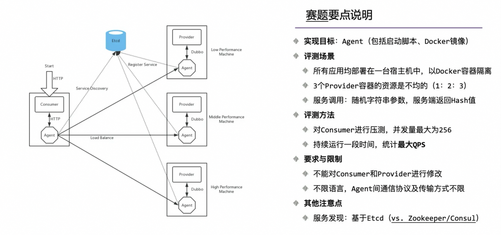
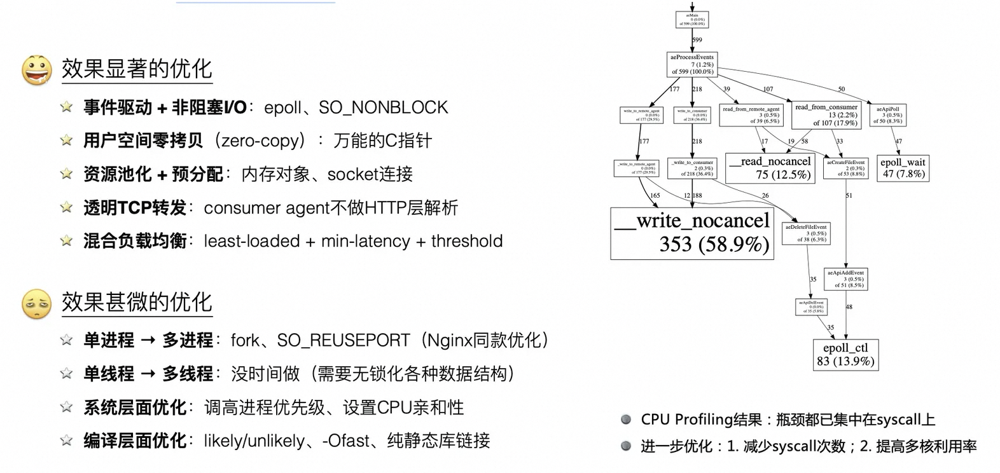
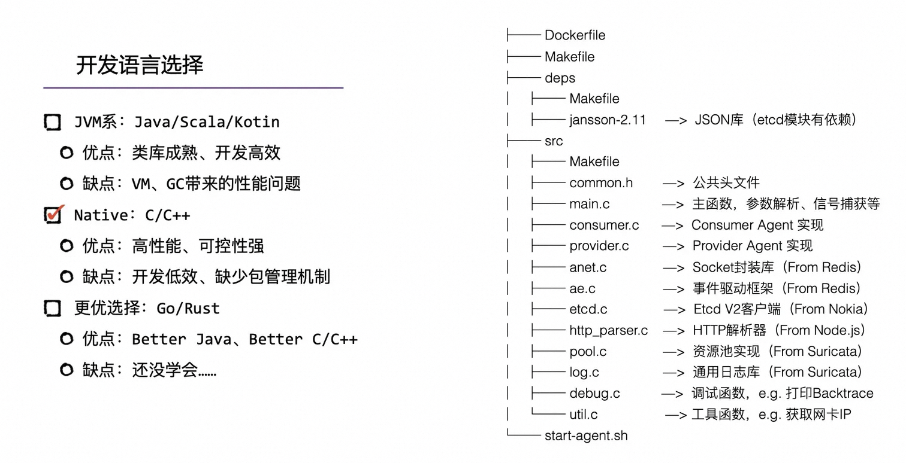

# Service Mesh Agent for Dubbo

## 赛题简介

## 实现方案

其中用到的一些技术点：

- 语言：用的**C**；当年还没用过Java写底层代码
- 依赖：JSON库是用的**jansson**，主要是etcd模块有依赖
- 网络：直接复用（copy）了Redis的代码，用来做**socket封装**和**事件驱动**
- 存储：服务发现需要用到etcd存储，当时是在网上找了一个Nokia的开源**etcd客户端**
- HTTP：用了网上广泛使用的、从node.js抽离出来的HTTP解析器（**http_parser**）
- 其他：还用了读书期间研究过的**Suricata**（一个IDS）的一些源码，包括资源池、日志库等

## 优化历程

一些效果还可以的优化：

- **事件驱动** + **⾮阻塞I/O**：epoll、SO_NONBLOCK
- 用户空间**零拷贝**（zero-copy）：万能的C指针
- **资源池化** + **预分配**：内存对象、socket连接
- 透明TCP转发：consumer agent 不做HTTP层解析
- 混合负载均衡：least-loaded + min-latency + threshold

一些效果不太行的优化（很可能只是我的使用姿势不对）：

- 单进程 → 多进程：fork、SO_REUSEPORT（Nginx同款优化）
- 单线程 → 多线程：没时间做（需要⽆锁化各种数据结构)
- 系统层面优化：调⾼高进程优先级、设置CPU亲和性
- 编译层面优化:：likely/unlikely、-Ofast、纯静态库链接

当时使用 **gperftools** 做了下 CPU profiling，显式的结果是瓶颈都在syscall上，进一步优化需要：1. 减少syscall次数；2. 提高多核利用率。
